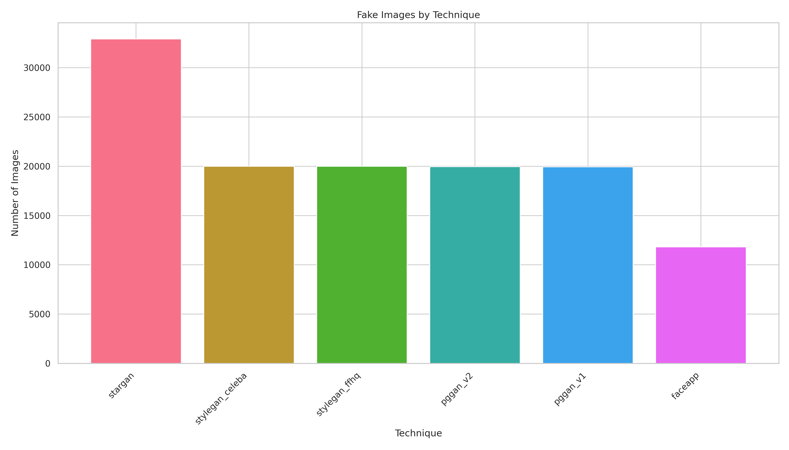

# Improving Robustness of DeepFake Detectors through Gradient Regularization
Project for the Computer Vision course, M.Eng in AI & Robotics

## Team
Pimpinelli Francesco 2214340 

Pitotti Leonardo 2000797

## Dataset
The provided dataset is a distillation made by us of DFFD.
We conducted an in-depth analysis over all the dataset to find the best way to derive samples for our task. The following image is a preview of the results, that can be consulted in the [dedicated folder](dataset/stats/DFFD): 


Thanks to the results we could derive a 10000 images [dataset](/dataset/samples/), picking random samples from every technique used in DFFD. Some stats about what we called Distilled-DFFD can be viewed [here](dataset/stats/Distilled_DFFD), here the general structure:


In the [source](/dataset/src/) folder we put the scripts that we used for all the analysis and manipulation.

⚠️ **It is not necessary to download the dataset, this will be done during runtime by the notebook.**

# Project Structure
```
CV_project/
├── dataset/                        # All the stuff related to the dataset
    └── samples/                     # Samples 
        └── test/
            └── fake/
            └── real/ 
        └── train/
            └── fake/
            └── real/
        └── validation/
            └── fake
            └── real
    └── src/                         # All the scripts for dataset analysis and manipulation    
    └── stats/                       # Some useful stats
        └── DFFD
        └── Distilled-DFFD
├── models/                         # Some useful pre-trained models
├── papers/                         # Papers related to the project
├── final_script.ipynb              # Main notebook
        ├── 🔽Imports
        │   ├── 🐈‍⬛GitHub
        ├── 🌐Globals
        │   ├── 🔤Paths
        │   ├── 🔁Repeatability
        │   ├── 🔢Hyperparameters
        ├── 🔧Utils
        │   ├── 🔌Perturbation Injection Module (PIM)
        │   ├── ✅Evaluation functions
        │   ├── ⚙️Train function
        │   ├── 🔎GridSearch
        │   ├── ⚔️Adversarial attacks
        ├── 🔣Data
        ├── 🖥️Network
        │   ├── 🥅EfficientNetV2 small (base)
        │   ├── 🆙EfficientNetV2 small (PIM)
        ├── 🏋️‍♂️Train
        ├── 💯Evaluation
        │   ├── 📊Plotting
        ├── 💥Adversarial Attacks
        │   ├── 🔭Overview
        │   ├── ⚔️FGSM
        │   ├── ⚔️PGD
        │   ├── ⚔️MI-FGSM
└── README.md               # Project documentation
```
# Notebook
Run the `final_script.ipynb` notebook on Kaggle or Colab. 

## WandB
To log the results, you need to have a WandB account and set the API key in your environment. In order to get the API key, go to your [WandB account settings](https://wandb.ai/authorize) and copy the API key.
In Colab you can add the key during the runtime, for Kaggle you have to put it in the secrets keys.

## How to Run
The notebook is meant to be run subsequently, just go to the **Control Room** section, set the **Hyperparameters** with the desired configuration and then hit **run all**; You can choose among these values:
``` python
GRID_SEARCH = False          # flag true if you want to perform a grid search, false if you only want to train
LOAD_FINETUNED = False       # flag true if you want to load our best fine-tuned model (modify below to choose if with PIM or not)
PLUG_PIM = False             # flag true if you want to plug PIM, false otherwise
ADV_ATTACK_TYPE = 'MI-FGSM'  # other options: 'FGSM', 'PGD', 'MI-FGSM', 'None'
```
Regarding the last variable, a more detailed overview of the attack options:

* **FGSM** ("Fast Gradient Sign Method") - Adds noise to the image in a single step. 
  
* **PGD** ("Projected Gradient Descent") -  Like FGSM but repeats the process multiple times to be more effective
  
* **MI-FGSM** ("Momentum Iterative FGSM") - Like PGD but with "momentum"
